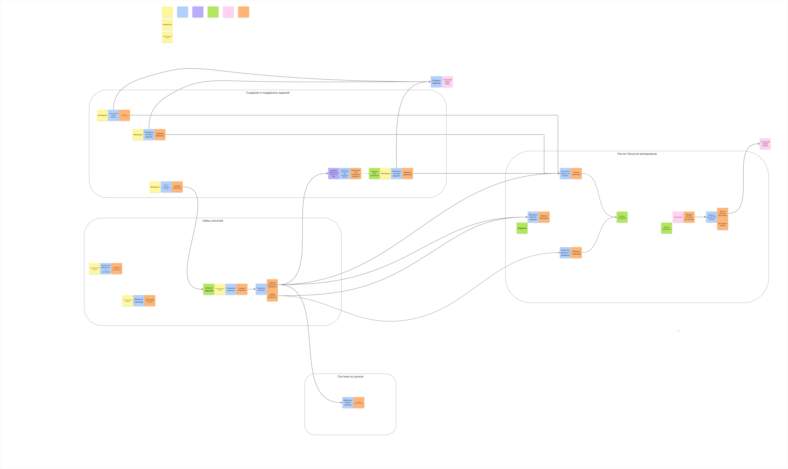
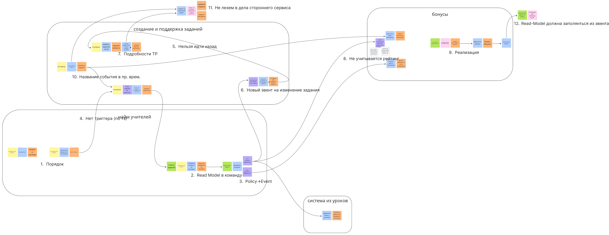

# Задание — Week 1

## 1. Event Storming

- Исправленный Event Storming: 
- Борда: [Ссылка на Holst](https://app.holst.so/share/b/72a9c628-279f-49d9-bb09-e2ce8d8520e0)
- Неверный Event Storming (с пометками/недочётами): 

### 1.1 Ошибки ES

1. Неправильный порядок событий по таймлайну: сначала регистрация → потом логин.
2. Read Model не может быть актором для команды: модель — это источник данных для актора при принятии решения.
3. По схеме получается, что команда продьюсит policy; должно быть, что команда продьюсит events.
4. Регистрация не триггерит менеджера — это несвязанная логика: регистрация и назначение менеджером заданий.
5. События на EventStorming раскладываются слева направо — по ходу времени.
6. Нужна ещё одна связка command → event, которая соблюдает таймлайн.
7. В командах и событиях завязка на техническую реализацию.
8. В требовании `[US-120]` начисление и списание бонусов зависят от рейтинга.
9. Процесс расчётного периода включает техническую реализацию.
10. Событие должно говорить о том, что **уже произошло**.
11. Для нашей модели события стороннего сервиса не важны.
12. Команда должна триггерить сторонний сервис напрямую; команда не порождает read model напрямую.

## 2. Коммуникации по исправленному Event Storming

Выбрал два процесса и для каждого указал:

- синхронную HTTP-коммуникацию (эндпоинт);
- асинхронную event-driven коммуникацию (название события в коде).

| Вид связи                | Команда / событие из EventStorming                    | Эндпоинт / событие в коде |
|--------------------------|-------------------------------------------------------|---------------------------|
| Синхронная HTTP          | Команда: **Регистрация нового задания**               | `POST /api/task/register` |
| Асинхронная event-driven | Событие: **Задание зарегистрировано**                 | `Task.Registered`         |
| Синхронная HTTP          | Команда: **Назначить задание потенциальному учителю** | `POST /api/tasks/assign`  |
| Асинхронная event-driven | Событие: **Задание потенциальному учителю назначено** | `Task.Assigned`           |

## 3. События в текущей системе (что исправить)

### EVENT-010

```json
{
  "event_name": "TaskRating",
  "payload": {
    "value": "completed"
  }
}
```

**Проблемы:**

- `TaskRating` — не отражает, что именно произошло (нет “прошедшего времени”/факта изменения).
- В payload недостаточно данных: не хватает хотя бы `task_id` и итогового `rating_value`.

### EVENT-020

```json
{
  "event_name": "Task",
  "payload": {
    "id": 1,
    "rating": "0.04",
    "name": "...",
    "description": "...",
    "author": {
      "id": 1,
      "name": "Pavel",
      "email": "...",
      "role": "manager",
      "created_at": "..."
    },
    "attempt_count": "",
    "answers": [
      {
        "id": 1,
        "text": "...",
        "status": "author",
        "assigned": {
          "id": 2,
          "name": "Nick",
          "email": "...",
          "role": "maybe_teacher",
          "created_at": "..."
        }
      }
    ],
    "created_at": "..."
  }
}
```

**Проблемы:**

- `Task` — слишком общее название: по нему непонятно, в чём смысл события.
- Payload избыточный: вложенные объекты лучше заменить на идентификаторы (например, `author_id`, `assigned_id`).

### EVENT-030

```json
{
  "event_name": "CalculateTaskRating",
  "payload": {
    "id": 1
  }
}
```

**Проблемы:**

- `CalculateTaskRating` — формулировка команды (что нужно сделать), а событие должно формулировать факт (что уже
  сделано).
- Формат лучше унифицировать с `Task.RatingCalculated`.

## 4. Изменение коммуникаций в сервисах

| Номер связи                | Как связь сделана на текущий момент | Какая теперь будет связь | Номера проблем бизнеса, которые потенциально решатся                                | Почему связь необходимо изменить                                                                                                                                                             |
|----------------------------|-------------------------------------|--------------------------|-------------------------------------------------------------------------------------|----------------------------------------------------------------------------------------------------------------------------------------------------------------------------------------------|
| `[COMM-010]`, `[COMM-030]` | HTTP-вызов, синхронная              | Связи не будет           | Частично: `[Problem-080]`, `[Problem-050]`, `[Problem-090]`                         | Сервис найма учителей будет сам оповещать о факте выполнения задания. Policy “> 10 раз подряд” будет находиться только в сервисе создания и поддержки задания — уменьшим связность сервисов. |
| `[COMM-020]`               | HTTP-вызов, синхронная              | Kafka, асинхронная       | `[Problem-020]`, `[Problem-021]`, `[Problem-080]`                                   | Будем стримить информацию о задании из сервиса создания и поддержки задания в сервис найма. Уменьшим связность сервисов.                                                                     |
| `[COMM-040]`, `[COMM-050]` | HTTP-вызов, синхронная              | Kafka, асинхронная       | `[Problem-040]`, `[Problem-050]`, `[Problem-060]`, `[Problem-070]`, `[Problem-080]` | Будем стримить информацию о выполнении задания из сервиса найма в сервис расчёта бонусов менеджерам. Уменьшим связность сервисов.                                                            |
| `[COMM-060]`               | Kafka, асинхронная                  | Связи не будет           | `[Problem-030]`, `[Problem-080]`                                                    | Нужно уменьшить связность сервисов найма и бонусов. Логику изменения рейтинга перенесём в сервис выплаты бонусов — так решим проблему корректного вычисления рейтинга задания.               |
| `[COMM-070]`               | HTTP-вызов, синхронная              | Kafka, асинхронная       | `[Problem-040]`, `[Problem-080]`                                                    | Информация о менеджере будет стримиться в сервис бонусов — уменьшим связность сервисов.                                                                                                      |
| `[COMM-080]`               | HTTP-вызов, синхронная              | Связи не будет           | `[Problem-040]`, `[Problem-070]`, `[Problem-080]`                                   | Сервис бонусов не будет вызывать сервис поддержки заданий. Вся логика начислений будет изолирована внутри сервиса бонусов — уменьшим связность сервисов.                                     |
| `[COMM-090]`               | HTTP-вызов, синхронная              | Kafka, асинхронная       | `[Problem-070]`                                                                     | Информацию о кандидатах будем стримить из сервиса найма в сервис поддержки заданий — уменьшим связность сервисов.                                                                            |

## 5. Фича с чатом (выбор брокера)

Kafka в данном случае **ок**, но это не значит, что другие message broker-ы не подойдут.

Чтобы обосновать выбор именно Kafka, нужно зафиксировать требования:

- latency / throughput;
- стоимость решения и поддержки;
- retention / replay;
- гарантии по потере сообщений (at-least-once / exactly-once / дедупликация);
- требования к порядку сообщений (например, порядок в рамках диалога).
