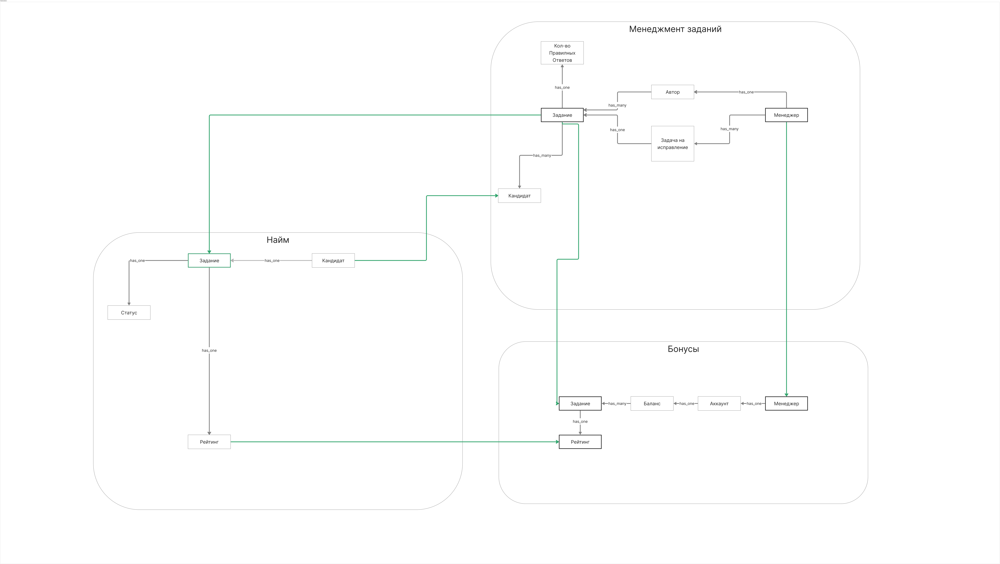
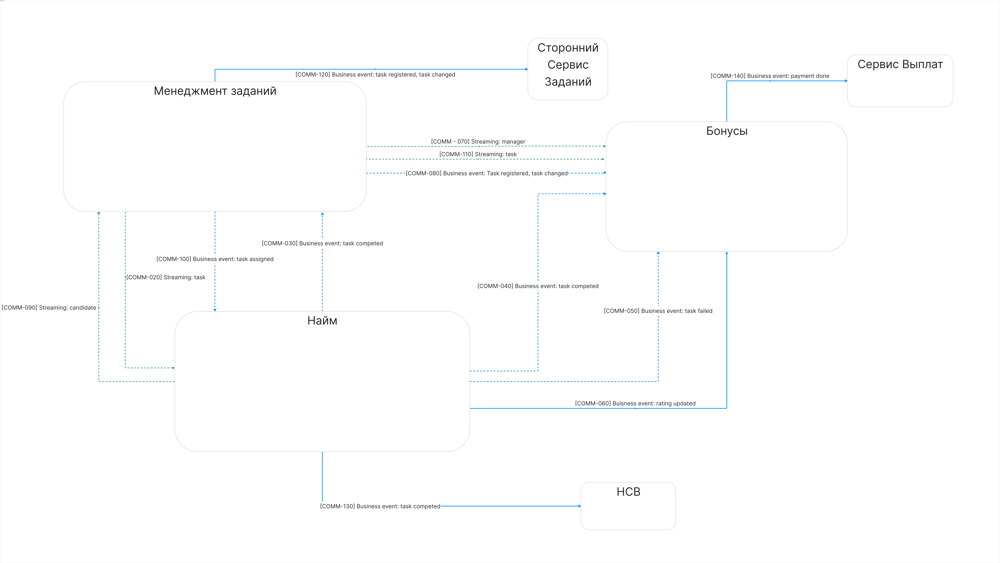

# Задание — Week 2

## 1. Концептуальная модель данных

- Исходная модель данных: 

### 1.1 Ошибки в исходной модели

1. Сущность менеджера не нужна в контексте найма.
2. Рейтинг рассчитывается в контексте найма по техническим требованиям и передаётся в контекст Бонусов через отдельную
   сущность. Задание является агрегатом контекста менеджмента и стримится в контекст Бонусов. Это приводит к
   протеканию абстракции; корректнее рассчитывать рейтинг в контексте Бонусов (но пока так).
3. Для начисления бонусов требуется информация о менеджере.
4. Промежуточная сущность задач избыточна: по требованиям одно задание назначается кандидатам.
5. Аналогично в контексте найма: по требованиям задание должно иметь связь `has_one` с кандидатом.

- Исправленная модель данных: 
- Борда: [Ссылка на Holst](https://app.holst.so/share/b/72a9c628-279f-49d9-bb09-e2ce8d8520e0)

## 2. Коммуникации по концептуальной модели

| Вид связи                | Название сущности из концептуальной модели данных | Название эндпоинта или события в коде |
|--------------------------|---------------------------------------------------|---------------------------------------|
| Синхронная HTTP          | Рейтинг                                           | `POST /api/task/{id}/rating/update`   |
| Асинхронная event-driven | Рейтинг                                           | `Rating.Updated`                      |
| Синхронная HTTP          | Задание                                           | `POST /api/task/{id}/change`          |
| Асинхронная event-driven | Задание                                           | `Task.Changed`                        |

### 2.1 Модель формальных и функциональных связей

### 2.2 Consistency связей

- `[COMM-020]` — eventual consistency
- `[COMM-030]` — eventual consistency
- `[COMM-040]` — eventual consistency
- `[COMM-060]` — strong consistency
- `[COMM-080]` — eventual consistency
- `[COMM-090]` — eventual consistency
- `[COMM-100]` — eventual consistency
- `[COMM-110]` — eventual consistency
- `[COMM-120]` — eventual consistency
- `[COMM-130]` — eventual consistency
- `[COMM-140]` — eventual consistency

## 3. Изменение связей после первого и второго урока

| Номер связи  | Как связь сделана на текущий момент | Как изменилась связь после первого урока | Какая теперь будет связь после второго урока                                       | Номера проблем бизнеса, которые потенциально решатся                                | Почему связь необходимо изменить                                                                                               |
|--------------|-------------------------------------|------------------------------------------|------------------------------------------------------------------------------------|-------------------------------------------------------------------------------------|--------------------------------------------------------------------------------------------------------------------------------|
| `[COMM-010]` | HTTP-вызов, синхронная              | Связи не будет                           | Связи не будет                                                                     | Частично: `[Problem-080]`, `[Problem-050]`, `[Problem-090]`                         | В контексте найма не нужна доменная сущность менеджера. Уменьшаем связность сервисов.                                          |
| `[COMM-020]` | HTTP-вызов, синхронная              | Kafka, асинхронная                       | Kafka, асинхронная (`Task.Registered`, `Task.Changed`, `Task.Deleted`)             | `[Problem-020]`, `[Problem-021]`, `[Problem-080]`                                   | Реплицируем жизненный цикл задания из Менеджмента заданий в Найм, без синхронной зависимости.                                  |
| `[COMM-030]` | HTTP-вызов, синхронная              | Связи не будет                           | Связи не будет                                                                     | Частично: `[Problem-080]`, `[Problem-050]`, `[Problem-090]`                         | Policy “10 правильных подряд” обрабатывается в доменной логике, без лишнего межсервисного вызова.                              |
| `[COMM-040]` | HTTP-вызов, синхронная              | Kafka, асинхронная                       | Kafka, асинхронная (`Task.Completed`)                                              | `[Problem-040]`, `[Problem-050]`, `[Problem-060]`, `[Problem-070]`, `[Problem-080]` | Начисление в Бонусах запускается доменным событием о корректном выполнении задания.                                            |
| `[COMM-050]` | HTTP-вызов, синхронная              | Kafka, асинхронная                       | Kafka, асинхронная (`Task.Failed`)                                                 | `[Problem-040]`, `[Problem-050]`, `[Problem-060]`, `[Problem-070]`, `[Problem-080]` | Списание в Бонусах запускается доменным событием о некорректном выполнении задания.                                            |
| `[COMM-060]` | Kafka, асинхронная                  | Связи не будет                           | HTTP-вызов, синхронная (`Bonuses -> Hiring: GET /api/task/{id}/rating`)            | `[Problem-030]`, `[Problem-080]`                                                    | Для `[US-111]` рейтинг при начислении должен быть максимально актуальным, поэтому здесь strong consistency.                    |
| `[COMM-070]` | HTTP-вызов, синхронная              | Kafka, асинхронная                       | Kafka, асинхронная (`Manager.Created`, `Manager.Updated`, `Manager.Deleted`)       | `[Problem-040]`, `[Problem-080]`                                                    | Реплицируем менеджеров в Бонусы, уменьшаем синхронную связность.                                                               |
| `[COMM-080]` | HTTP-вызов, синхронная              | Связи не будет                           | Связи не будет (дублирование убрано, объединён с `[COMM-020]`)                     | `[Problem-040]`, `[Problem-070]`, `[Problem-080]`                                   | Отдельный поток по `Task.Registered/Task.Changed` дублировал репликацию задач; оставлен единый канал жизненного цикла задания. |
| `[COMM-090]` | HTTP-вызов, синхронная              | Kafka, асинхронная                       | Kafka, асинхронная (`Candidate.Created`, `Candidate.Updated`, `Candidate.Deleted`) | `[Problem-070]`                                                                     | Кандидаты реплицируются в Менеджмент заданий без прямых синхронных запросов.                                                   |

## 4. Названия топиков и событий

| Название очереди / топика    | Названия событий и номеров связей, которые окажутся в топике                       | Почему в топике именно эти события                                  | Почему так назвали                                     |
|------------------------------|------------------------------------------------------------------------------------|---------------------------------------------------------------------|--------------------------------------------------------|
| `domain.task.lifecycle`      | `Task.Registered`, `Task.Changed`, `Task.Deleted`; связь: `[COMM-020]`             | Единый поток жизненного цикла задания из Менеджмента заданий в Найм | Домен + сущность + группа событий жизненного цикла     |
| `domain.task.result`         | `Task.Completed`, `Task.Failed`; связи: `[COMM-040]`, `[COMM-050]`                 | Эти события напрямую запускают начисление/списание в Бонусах        | Домен + сущность + бизнес-результат выполнения задания |
| `data_replication.manager`   | `Manager.Created`, `Manager.Updated`, `Manager.Deleted`; связь: `[COMM-070]`       | Данные менеджеров нужны в Бонусах                                   | Нейминг для data replication                           |
| `data_replication.candidate` | `Candidate.Created`, `Candidate.Updated`, `Candidate.Deleted`; связь: `[COMM-090]` | Данные кандидатов нужны в Менеджменте заданий                       | Нейминг для data replication                           |
| `domain.task.assigned`       | `Task.Assigned`; связь: `[COMM-100]`                                               | Бизнес-событие назначения задания кандидату                         | Домен + сущность + действие                            |

## 5. Выбор способа передачи данных

- Список заданий для назначения кандидатам передаётся через Read Model, потому что важна событийная часть (кто создал и
  кто обновил задание).
- Список кандидатов для назначения заданий и список менеджеров для начисления бонусов передаётся через модель данных,
  потому что здесь нужны статические данные, а история изменений не критична.
